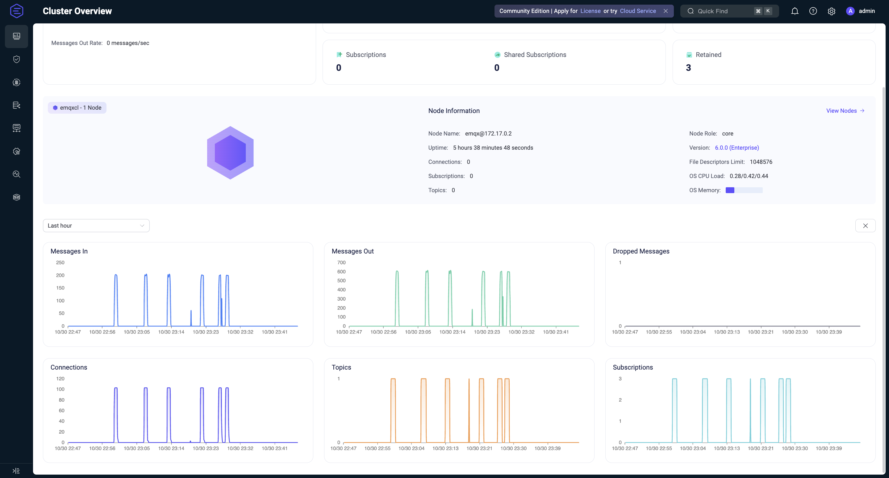

# BÁO CÁO BÀI TẬP MQTT

- **Họ và tên:** Đặng Tiến Cường 
- **MSSV:** 20220020
- **Lớp:** CTTN-KHMT K67
- **Ngày thực hiện:** 30/11/2025

## 1. GIỚI THIỆU

Bài tập thực hiện mô phỏng hệ thống IoT với 100 thiết bị giao tiếp qua giao thức MQTT. Chương trình sử dụng:

- **Ngôn ngữ:** Python 3.13
- **Broker:** EMQX (local)
- **Công nghệ:** Multi-threading để mô phỏng 100 thiết bị đồng thời

## 2. EMQX BROKER
### 2.1. Cài đặt
Nếu chưa cài đặt EMQX, bạn có thể sử dụng Docker để chạy broker:

```bash
# Pull image EMQX
docker pull emqx/emqx:latest

# Chạy container EMQX
docker run -d --name emqx-mqtt -p 1883:1883 -p 8083:8083 -p 8084:8084 -p 18083:18083 emqx/emqx:latest
```

### 2.2. EMQX Dashboard



Truy cập vào EMQX Dashboard để kiểm tra trạng thái hoạt động của broker.
- **URL truy cập:** http://localhost:18083  
- **Username:** admin  
- **Password:** public

<table>
      <caption>Các thông số quan trọng</caption>
      <thead>
        <tr>
          <th>Thông số</th>
          <th>Mô tả</th>
          <th>Vị trí xem</th>
        </tr>
      </thead>
      <tbody>
        <tr>
          <td>Connections</td>
          <td>Số kết nối hiện tại</td>
          <td>Dashboard → Overview</td>
        </tr>
        <tr>
          <td>Subscriptions</td>
          <td>Số subscription đang hoạt động</td>
          <td>Dashboard → Subscriptions</td>
        </tr>
        <tr>
          <td>Topics</td>
          <td>Danh sách topics</td>
          <td>Dashboard → Topics</td>
        </tr>
        <tr>
          <td>Message In/Out Rate</td>
          <td>Tốc độ tin nhắn</td>
          <td>Dashboard → Metrics</td>
        </tr>
        <tr>
          <td>Uptime</td>
          <td>Thời gian chạy</td>
          <td>Dashboard → Overview</td>
        </tr>
        <tr>
          <td>Memory Usage</td>
          <td>Bộ nhớ sử dụng</td>
          <td>Dashboard → Metrics</td>
        </tr>
      </tbody>
    </table>

## 3. CẤU TRÚC DỰ ÁN

```
ex2-mqtt/
├── main.py                     # Entry point của chương trình
├── requirements.txt           # Danh sách các thư viện phụ thuộc
├── README.md                  # Tài liệu hướng dẫn
├── cli/                       # Module command line interface
│   ├── __init__.py
│   └── commands.py            # Xử lý các lệnh CLI
├── logs/                      # Thư mục lưu trữ log
├── images/                    # Thư mục lưu ảnh
├── src/                       # Source code chính
│   ├── __init__.py
│   ├── simulation.py          # Lớp mô phỏng tổng thể
│   ├── constants/             # Hằng số và cấu hình
│   │   ├── __init__.py
│   │   └── constants.py       # Các hằng số MQTT và thiết bị
│   ├── publisher/             # Module publisher
│   │   ├── __init__.py
│   │   └── publisher.py       # Lớp thiết bị publisher
│   ├── subscriber/            # Module subscriber
│   │   ├── __init__.py
│   │   └── subscriber.py      # Lớp thiết bị subscriber
│   └── utils/                 # Công cụ hỗ trợ
│       ├── __init__.py
│       ├── logger_utils.py    # Cấu hình logging
│       └── statistics_utils.py # Quản lý thống kê
```

## 4. THIẾT KẾ CHƯƠNG TRÌNH

### 4.1. Cấu trúc mô phỏng

Chương trình được thiết kế theo mô hình publisher/subscriber (pub/sub) của MQTT:

- **Publishers (Thiết bị cảm biến):** Mô phỏng 100 thiết bị IoT gửi dữ liệu cảm biến
- **Subscribers (Trạm nhận dữ liệu):** Mô phỏng 3 trạm nhận dữ liệu từ các thiết bị
- **Broker:** EMQX hoạt động như trung gian truyền tin MQTT

### 4.2. Lớp DevicePublisher

Lớp này đại diện cho một thiết bị IoT gửi dữ liệu cảm biến, có các đặc điểm:

- Kết nối đến MQTT broker với client ID duy nhất
- Gửi dữ liệu cảm biến định kỳ (mặc định mỗi 5 giây)
- Mỗi thiết bị gửi 10 tin nhắn (có thể cấu hình)
- Dữ liệu cảm biến bao gồm: nhiệt độ, độ ẩm, áp suất, chất lượng không khí
- Các vị trí cảm biến: trung tâm thành phố, công viên phía bắc, khu công nghiệp, đường 123

### 4.3. Lớp DeviceSubscriber

Lớp này đại diện cho trạm nhận dữ liệu, có các đặc điểm:

- Đăng ký nhận dữ liệu từ tất cả các topic có dạng `iot/environment/#`
- Nhận và xử lý thông điệp từ nhiều thiết bị cùng lúc
- Ghi nhận thống kê về số lượng tin nhắn nhận được

### 4.4. Lớp Simulation

Lớp trung tâm quản lý toàn bộ quá trình mô phỏng:

- Khởi tạo và điều phối các publisher và subscriber
- Theo dõi thống kê hoạt động
- Cung cấp 3 chế độ mô phỏng: full, pub-only, sub-only

## 5. SỬ DỤNG CHƯƠNG TRÌNH

### 5.1. Cài đặt dependencies

```bash
pip install -r requirements.txt
```

### 5.2. Chạy mô phỏng đầy đủ (100 publishers, 3 subscribers)

```bash
python main.py
```

### 5.3. Chạy với số lượng thiết bị tùy chỉnh

```bash
# Chạy với 50 publisher và 2 subscriber
python main.py --publishers 50 --subscribers 2

# Chạy chỉ với publisher
python main.py --mode pub-only --publishers 100

# Chạy chỉ với subscriber
python main.py --mode sub-only --subscribers 3
```

### 5.4. Các tùy chọn khác

```bash
python main.py --help
```

## 6. KẾT QUẢ MÔ PHỎNG

### 6.1. Thống kê hiệu suất

Chương trình ghi nhận các thống kê sau:
- Tổng số tin nhắn đã gửi
- Tổng số tin nhắn đã nhận
- Số kết nối publisher/subscriber đang hoạt động
- Số lỗi trong quá trình hoạt động

### 6.2. Mô phỏng với 100 thiết bị

Trong mô phỏng đầy đủ:
- 100 thiết bị publisher gửi dữ liệu cảm biến
- 3 trạm subscriber nhận dữ liệu
- Mỗi thiết bị gửi 10 tin nhắn định kỳ
- Hệ thống xử lý hơn 1000 tin nhắn qua MQTT broker

Xem kết quả tại đây: 

## 7. KẾT LUẬN

Bài tập đã thực hiện thành công mô phỏng hệ thống IoT gồm 100 thiết bị giao tiếp qua giao thức MQTT. Các kết quả đạt được:

- Thiết lập thành công MQTT broker sử dụng EMQX
- Mô phỏng thành công 100 thiết bị publisher và 3 subscriber hoạt động đồng thời
- Đảm bảo truyền nhận dữ liệu ổn định qua giao thức MQTT
- Thu thập và hiển thị thống kê hoạt động của hệ thống
- Xây dựng hệ thống có khả năng mở rộng và cấu hình linh hoạt

Hệ thống chứng minh hiệu quả của mô hình pub/sub trong việc xử lý dữ liệu từ nhiều thiết bị IoT cùng lúc.
