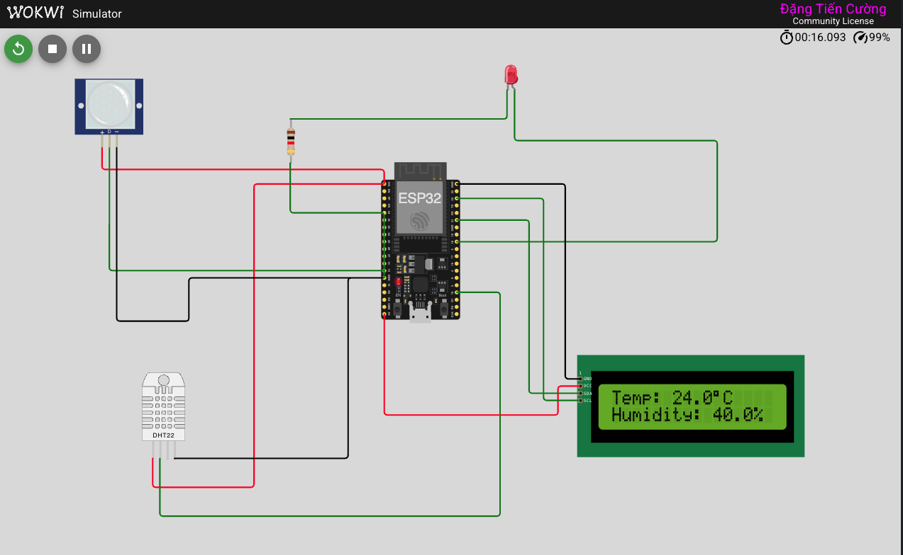

# ESP32 Sensor Simulation - Nhiệt độ, độ ẩm và cảm biến chuyển động

Đây là dự án mô phỏng ESP32 đọc dữ liệu nhiệt độ và độ ẩm từ cảm biến DHT22, đồng thời phát hiện chuyển động bằng cảm biến PIR. Dữ liệu được hiển thị trên màn hình LCD1602 và điều khiển đèn LED dựa trên phát hiện chuyển động.

## Mô tả chức năng

- Đọc dữ liệu nhiệt độ và độ ẩm từ cảm biến DHT22
- Phát hiện chuyển động bằng cảm biến PIR
- Hiển thị dữ liệu lên màn hình LCD1602
- Điều khiển đèn LED khi phát hiện chuyển động
- Ghi log dữ liệu ra Serial Monitor

## Thành phần phần cứng ảo (Wokwi)

- Board ESP32 DOIT DEVKIT V1
- Cảm biến DHT22 (nhiệt độ/độ ẩm)
- Cảm biến chuyển động PIR
- Màn hình LCD1602 (kết nối I2C)
- LED đỏ

## Kết nối phần cứng

| Cảm biến | ESP32 Pin | Mô tả |
|----------|-----------|-------|
| DHT22 VCC | 3V3 | Nguồn |
| DHT22 GND | GND | Nối đất |
| DHT22 SDA | GPIO15 | Dữ liệu |
| PIR VCC | 3V3 | Nguồn |
| PIR GND | GND | Nối đất |
| PIR OUT | GPIO12 | Tín hiệu đầu ra |
| LCD SDA | GPIO21 | Giao tiếp I2C |
| LCD SCL | GPIO22 | Giao tiếp I2C |
| LCD VCC | 5V | Nguồn |
| LCD GND | GND | Nối đất |
| LED | GPIO18 | Điều khiển LED |

## Cài đặt và chạy mô phỏng

### Bước 1: Cài đặt công cụ cần thiết trên VS Code

1. Mở VS Code
2. Vào mục Extensions (biểu tượng 4 ô vuông bên trái)
3. Tìm và cài đặt 2 extension sau:
   - PlatformIO IDE (Biểu tượng đầu kiến): Dùng để quản lý thư viện và biên dịch code offline
   - Wokwi Simulator: Dùng để hiển thị mô phỏng mạch ngay trong VS Code

### Bước 2: Thiết lập dự án

Dự án này đã được cấu hình sẵn với các thư viện cần thiết trong tệp `platformio.ini`:

```ini
[env:esp32doit-devkit-v1]
platform = espressif32
board = esp32doit-devkit-v1
framework = arduino
monitor_speed = 115200
lib_deps =
    marcoschwartz/LiquidCrystal_I2C @ ^1.1.4
    adafruit/DHT sensor library @ ^1.4.4
    adafruit/Adafruit Unified Sensor @ ^1.1.9
```

### Bước 3: Cài đặt license Wokwi (Miễn phí)

1. Bấm F1 trên VS Code
2. Gõ "Wokwi: Request a new license"
3. Trình duyệt sẽ mở ra, bạn đăng nhập và bấm "Get License"
4. Copy mã key và dán vào ô nhập trên VS Code

### Bước 4: Chạy mô phỏng

1. Mở terminal trong VS Code và chạy lệnh:
   ```
   pio run
   ```
   hoặc sử dụng thanh bên PlatformIO để Build

2. Sau khi build thành công, mở file `diagram.json`

3. Bấm vào nút Play (màu xanh) xuất hiện trong cửa sổ sơ đồ mạch để chạy mô phỏng

### Bước 5: Theo dõi kết quả

- Màn hình LCD sẽ hiển thị nhiệt độ và độ ẩm
- LED sẽ bật khi cảm biến PIR phát hiện chuyển động
- Dữ liệu cũng được in ra Serial Monitor

## Chức năng code

- Sử dụng `millis()` thay vì `delay()` để đọc cảm biến DHT mỗi 2 giây mà không làm chậm chương trình
- Phát hiện thay đổi trạng thái cảm biến PIR để bật/tắt LED
- Xử lý lỗi cảm biến DHT (kiểm tra giá trị hợp lệ)
- Giao tiếp với LCD qua giao thức I2C

## Tệp tin quan trọng

- `src/main.cpp`: Mã nguồn chính của dự án
- `platformio.ini`: Cấu hình PlatformIO và thư viện
- `diagram.json`: Sơ đồ mạch ảo Wokwi
- `wokwi.toml`: Cấu hình Wokwi Simulator

## Kết quả mô phỏng

Dưới đây là hình ảnh minh họa cho kết quả mô phỏng thành công:



Hình ảnh cho thấy:
- Màn hình LCD hiển thị nhiệt độ và độ ẩm hiện tại
- LED bật sáng khi cảm biến PIR phát hiện chuyển động
- Giao diện mô phỏng Wokwi với các thành phần kết nối chính xác