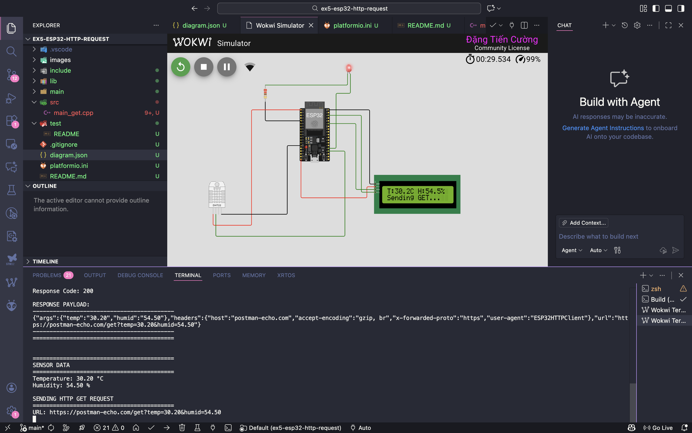
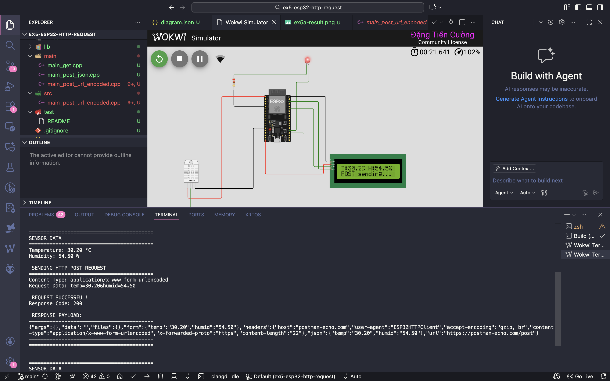
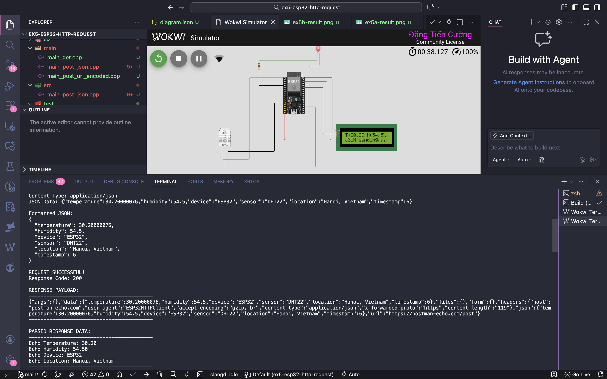

# BÁO CÁO BÀI TẬP 5
## ESP32 GỬI DỮ LIỆU HTTP REQUEST

---

## I. THÔNG TIN SINH VIÊN

| Thông tin | Nội dung |
|-----------|----------|
| **Họ và tên** | Đặng Tiến Cường|
| **MSSV** | 20220020 |
| **Lớp** | CTTN - Khoa học máy tính |
| **Ngày nộp** | 11/12/2025 |

---

## II. MỤC ĐÍCH BÀI TẬP

Lập trình cho ESP32 gửi dữ liệu cảm biến (nhiệt độ, độ ẩm) lên server thông qua các phương thức HTTP khác nhau:
- HTTP GET Request với URL-encoded parameters
- HTTP POST Request với URL-encoded body
- HTTP POST Request với JSON body

Công cụ: Wokwi Simulator (https://wokwi.com/)

---

## III. THIẾT BỊ VÀ THÀNH PHẦN

### Phần cứng ảo (Wokwi):
- ESP32 DevKit V1
- DHT22 Temperature & Humidity Sensor
- LCD1602 (I2C)
- LED + Resistor 220Ω

### Thư viện sử dụng:
```
- WiFi.h (Built-in ESP32)
- HTTPClient.h (Built-in ESP32)
- DHT sensor library v1.4.4
- Adafruit Unified Sensor v1.1.9
- LiquidCrystal I2C v1.1.2
- ArduinoJson v6.21.3
```

### Kết nối phần cứng:

| Thiết bị | ESP32 Pin | Mô tả |
|----------|-----------|-------|
| DHT22 VCC | 3V3 | Nguồn cấp |
| DHT22 GND | GND | Nối đất |
| DHT22 SDA | GPIO15 | Tín hiệu dữ liệu |
| LCD SDA | GPIO21 | I2C Data |
| LCD SCL | GPIO22 | I2C Clock |
| LCD VCC | 5V | Nguồn cấp |
| LCD GND | GND | Nối đất |
| LED Anode | GPIO2 | Tín hiệu điều khiển |
| LED Cathode | GND (qua R220Ω) | Nối đất |

---

## IV. SƠ ĐỒ MẠCH

[CHÈN ẢNH: Sơ đồ mạch từ Wokwi - Chụp toàn bộ giao diện]

**Mô tả:**
- ESP32 ở trung tâm kết nối với các thiết bị ngoại vi
- DHT22 đọc dữ liệu môi trường
- LCD hiển thị dữ liệu thời gian thực
- LED chỉ báo trạng thái kết nối và gửi dữ liệu

---

## V. NỘI DUNG THỰC HIỆN

---

### A. BÀI 5A: HTTP GET REQUEST

#### 1. Mô tả
Gửi dữ liệu nhiệt độ và độ ẩm qua URL parameters sử dụng phương thức HTTP GET.

**Endpoint:** `https://postman-echo.com/get`

**Format dữ liệu:**
```
https://postman-echo.com/get?temp=30.20&humid=54.50
```

#### 2. Code chương trình


#### 3. Kết quả thực hiện



#### 4. Phân tích kết quả

```
==========================================
SENSOR DATA
==========================================
Temperature: 30.20 °C
Humidity: 54.50 %

SENDING HTTP GET REQUEST
==========================================
URL: https://postman-echo.com/get?temp=30.20&humid=54.50

REQUEST SUCCESSFUL!
Response Code: 200

RESPONSE PAYLOAD:
------------------------------------------
{"args":{"temp":"30.20","humid":"54.50"},"headers":{"host":"postman-echo.com","accept-encoding":"gzip, br","x-forwarded-proto":"https","user-agent":"ESP32HTTPClient"},"url":"https://postman-echo.com/get?temp=30.20&humid=54.50"}
------------------------------------------
```

**Nhận xét:**
- Kết nối WiFi thành công
- Đọc được dữ liệu từ DHT22
- HTTP GET request thành công với response code 200
- Dữ liệu được gửi qua URL parameters trong field "args"
- Server echo lại đúng giá trị temp và humid

---

### B. BÀI 5B: HTTP POST REQUEST - URL-ENCODED

#### 1. Mô tả
Gửi dữ liệu nhiệt độ và độ ẩm qua POST body với Content-Type: application/x-www-form-urlencoded

**Endpoint:** `https://postman-echo.com/post`

**Format dữ liệu:**
```
temp=30.20&humid=54.50
```

#### 2. Code chương trình


#### 3. Kết quả thực hiện



#### 4. Phân tích kết quả

```
SENDING HTTP POST REQUEST
==========================================
Content-Type: application/x-www-form-urlencoded
Request Data: temp=30.20&humid=54.50

REQUEST SUCCESSFUL!
Response Code: 200

RESPONSE PAYLOAD:
------------------------------------------
{"args":{},"data":"","files":{},"form":{"temp":"30.20","humid":"54.50"},"headers":{"host":"postman-echo.com","user-agent":"ESP32HTTPClient","accept-encoding":"gzip, br","content-type":"application/x-www-form-urlencoded","x-forwarded-proto":"https","content-length":"22"},"json":{"temp":"30.20","humid":"54.50"},"url":"https://postman-echo.com/post"}
------------------------------------------
```

**Nhận xét:**
- HTTP POST request thành công với response code 200
- Dữ liệu được gửi trong POST body, không hiển thị trên URL
- Server nhận được dữ liệu trong field "form"
- Bảo mật tốt hơn GET vì dữ liệu không hiển thị trên URL

---

### C. BÀI 5C: HTTP POST REQUEST - JSON FORMAT

#### 1. Mô tả
Gửi dữ liệu nhiệt độ và độ ẩm dạng JSON qua POST body với Content-Type: application/json

**Endpoint:** `https://postman-echo.com/post`

**Format dữ liệu:**
```json
{
  "temperature": 30.20,
  "humidity": 54.50,
  "device": "ESP32",
  "sensor": "DHT22",
  "location": "Hanoi, Vietnam",
  "timestamp": 123
}
```

#### 2. Code chương trình


#### 4. Kết quả thực hiện



#### 5. Phân tích kết quả

```
SENDING HTTP POST REQUEST (JSON)
==========================================
Content-Type: application/json
JSON Data: {"temperature":30.2,"humidity":54.5,...}

Formatted JSON:
{
  "temperature": 30.20,
  "humidity": 54.50,
  "device": "ESP32",
  "sensor": "DHT22",
  "location": "Hanoi, Vietnam",
  "timestamp": 123
}

REQUEST SUCCESSFUL!
Response Code: 200

RESPONSE PAYLOAD:
{"args":{},"data":{"temperature":30.20000076,"humidity":54.5,"device":"ESP32","sensor":"DHT22","location":"Hanoi, Vietnam","timestamp":15},"files":{},"form":{},"headers":{"host":"postman-echo.com","user-agent":"ESP32HTTPClient","accept-encoding":"gzip, br","content-type":"application/json","x-forwarded-proto":"https","content-length":"120"},"json":{"temperature":30.20000076,"humidity":54.5,"device":"ESP32","sensor":"DHT22","location":"Hanoi, Vietnam","timestamp":15},"url":"https://postman-echo.com/post"}

PARSED RESPONSE DATA:
------------------------------------------
Echo Temperature: 30.20
Echo Humidity: 54.50
Echo Device: ESP32
Echo Location: Hanoi, Vietnam
------------------------------------------
```

**Nhận xét:**
- Sử dụng thư viện ArduinoJson để tạo và parse JSON
- Dữ liệu có cấu trúc rõ ràng, dễ mở rộng
- Server nhận được dữ liệu trong field "data"
- Có thể gửi nhiều thông tin phức tạp hơn (nested objects)
- Định dạng chuẩn cho RESTful API

---

## VI. SO SÁNH CÁC PHƯƠNG THỨC

| Tiêu chí | GET | POST URL-Encoded | POST JSON |
|----------|-----|------------------|-----------|
| **Vị trí dữ liệu** | URL parameters | POST body | POST body |
| **Content-Type** | - | application/x-www-form-urlencoded | application/json |
| **Độ bảo mật** | ⭐⭐ (Hiển thị trên URL) | ⭐⭐⭐⭐ | ⭐⭐⭐⭐⭐ |
| **Giới hạn dữ liệu** | ~2KB (URL limit) | ~8MB | ~8MB |
| **Cấu trúc phức tạp** | ❌ Không hỗ trợ | ⚠️ Hạn chế | ✅ Tốt nhất |
| **Cache được** | ✅ Có | ❌ Không | ❌ Không |
| **Bookmark được** | ✅ Có | ❌ Không | ❌ Không |
| **Tốc độ** | ⚡ Nhanh nhất | ⚡ Trung bình | ⚡ Chậm hơn một chút |
| **Dễ debug** | ✅ Rất dễ | ⚠️ Cần tool | ⚠️ Cần tool |
| **Ứng dụng** | Truy vấn đơn giản | Form submission | RESTful API |

---

## VII. TÀI LIỆU THAM KHẢO

1. ESP32 Arduino Core Documentation
   https://docs.espressif.com/projects/arduino-esp32/

2. ESP32 HTTPClient Library
   https://github.com/espressif/arduino-esp32/tree/master/libraries/HTTPClient

3. ArduinoJson Documentation
   https://arduinojson.org/v6/doc/

4. Postman Echo API
   https://www.postman.com/postman/workspace/published-postman-templates

5. Wokwi ESP32 Simulator
   https://docs.wokwi.com/guides/esp32

6. DHT Sensor Library
   https://github.com/adafruit/DHT-sensor-library